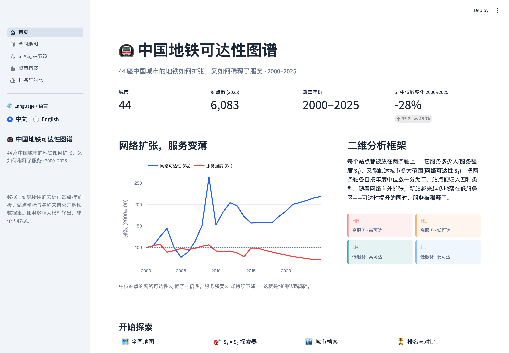
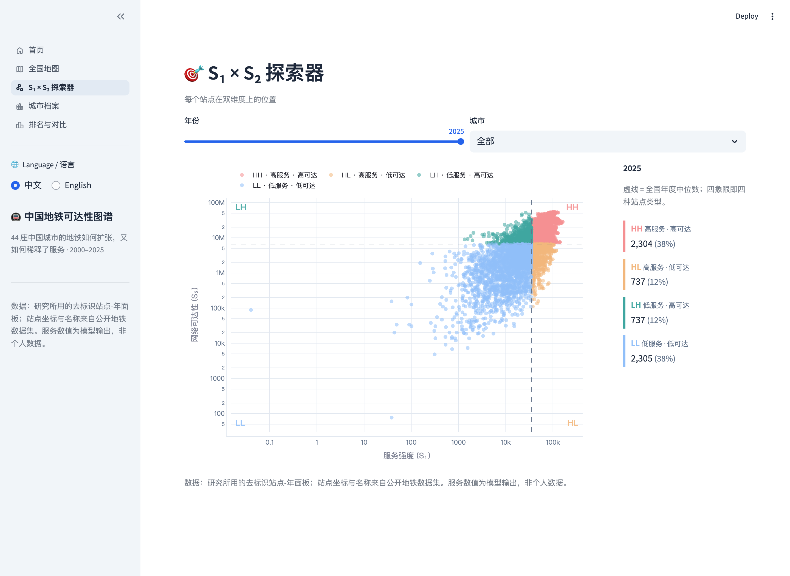
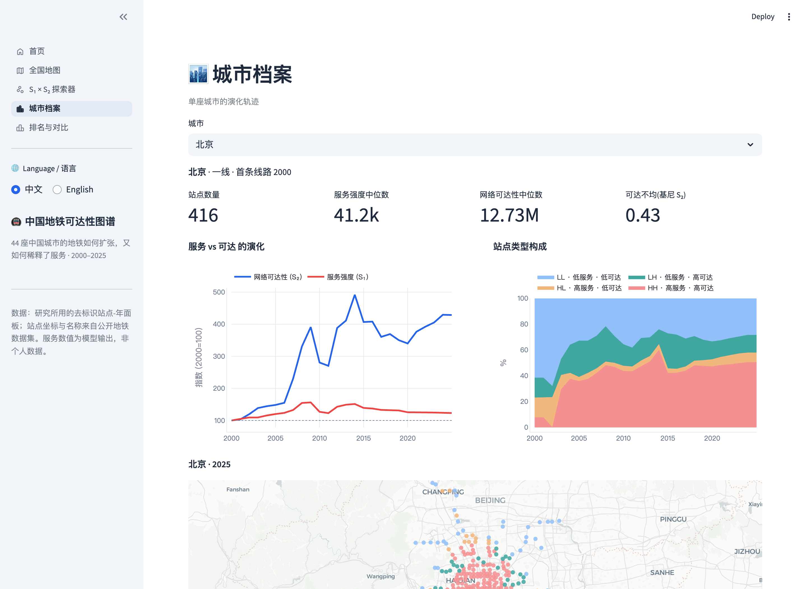

# 🚇 China Metro Accessibility Atlas · 中国地铁可达性图谱

An interactive platform that explores how **44 Chinese cities** scaled their metro
networks — and what that did to service — from **2000 to 2025**. It is the public
companion to the *Nature Cities* study **“Scaling Transit, Diluting Service: Urban
Development Trajectories in China since 2000.”**

> 一个交互式公开平台：看 44 座中国城市的地铁如何扩张，又如何稀释了服务（2000–2025）。
> 配套 *Nature Cities* 论文《Scaling Transit, Diluting Service》。界面支持中 / 英切换。

Every station is placed on two axes — **service intensity (S₁)**, the residents it
serves, and **network accessibility (S₂)**, the opportunities it can reach. As
networks expand outward, new stations increasingly land in low-service zones:
reach grows while service is *diluted*.



## ✨ Features

| | Page | What it does |
|---|------|------|
| 🗺️ | **National map** | Every station, year by year (2000→2025), coloured by type or by S₁/S₂. |
| 🎯 | **S₁ × S₂ explorer** | The two-dimensional signature plot with the annual-median quadrants. |
| 🏙️ | **City profile** | One city in depth: service-vs-reach trajectory, type mix, station map. |
| 🏆 | **Rankings & compare** | Rank and compare all 44 cities; sortable table; CSV download. |
| 🌐 | **Bilingual** | Full English / 中文 toggle, including navigation. |

<p align="center">
  
  
</p>

## 🚀 Run locally

```bash
pip install -r requirements.txt
streamlit run app.py
```

Then open <http://localhost:8501>. The app loads two small Parquet files in `data/`
— no GIS stack or API keys required.

## ☁️ Deploy to Streamlit Community Cloud (free)

1. Push this folder to a **GitHub** repository.
2. Go to <https://share.streamlit.io> → **New app**.
3. Pick the repo, branch, and set the main file to **`app.py`**.
4. **Deploy**. Streamlit installs `requirements.txt` and serves the app at a public URL.

The map basemaps are token-free (Carto / OpenStreetMap), so nothing else needs configuring.

## 🗂️ Project layout

```
app.py                 router + language toggle (st.navigation)
views/                 home, national_map, explorer, city_profile, rankings
lib/                   i18n (中/英), theme (colours), data loaders, chart style
data/                  stations.parquet, city_year.parquet   ← shipped with the app
build_data.py          one-time data build (authors only; needs the capsule)
```

## 🔢 Data & provenance

- `data/stations.parquet` — one row per **station-year** (44 cities · 6,083 stations ·
  2000–2025): S₁, S₂, station type, tier, plus longitude/latitude and public names.
- `data/city_year.parquet` — per **city-year** aggregates: medians, Gini, type mix, new stations.
- Station **types** (HH / HL / LH / LL) and city **tiers** are computed with the paper's
  own `shared_config`, so the platform matches the publication exactly (e.g. the 2025
  national mix is HH 38 % · HL 12 % · LH 12 % · LL 38 %).
- Service values are **model outputs, not personal data**. Coordinates and names come
  from the public metro dataset; the full-resolution raw output is **not** distributed here.

To rebuild the Parquet files from the de-identified Code Ocean capsule:

```bash
METRO_CAPSULE=/path/to/codeocean_capsule python build_data.py   # needs geopandas, pyarrow
```

## 📄 Citation

If you use this platform, please cite the paper:

> *Scaling Transit, Diluting Service: Urban Development Trajectories in China since 2000.*
> Nature Cities (under review).

## ⚖️ License

Application code released under the MIT License. Underlying accessibility data accompanies
the paper and its reproducibility capsule; please cite the paper when reusing it.
